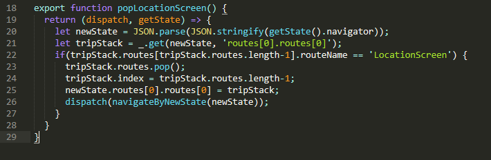

# Trippy

A mobile application for travelling

 

# Table of Contents

[Introduction](#Introduction)
[Trippy – A mobile application for travelling](#Trippy-–-A-mobile-application-for-travelling)
[Objectives](#Objectives)
[Functional Objectives](#Functional-Objectives)
[Login](#Login)
[Trip Creation](#Trip-Creation)
[Map View](#Map-View)
[Directions View](#Directions-View)
[Learning Objectives](#Learning-Objectives)
[Choice of Technology](#Choice-of-Technology)
[Ecosystem - React-Native](#Ecosystem---React-Native)
[Navigation – React-Navigation](#Navigation-–-React-Navigatio)
[State Management – Redux](#State Management-–-Redux)
[Backend – Firebase](#Backend-–-Firebase)
[Implementation](#Implementation)
[Navigation](#Navigation)
[Components](#Components)
[Redux](#Redux)
[Conclusion](#Conclusion)
[References](#References)

# Introduction

This paper is about the development of a mobile application named Trippy. The paper outlines the idea, choice of technology and frameworks as well as both functional goals with the application and the learning goals that I&#39;ve had that have directed several choices during development.

I&#39;ve added a screen or two of all the different key aspects of the code in this paper, however these only represent a very small part of the overall code. For example, while I show a couple of screens of components in this paper, the code in its totality uses around 27 components.

To view the full code (except some non-committed files with API keys), visit [https://github.com/NielsLindberg/Trippy](https://github.com/NielsLindberg/Trippy) most of the non-scaffolding generated code lies within the &#39;app&#39; folder.

## Trippy – A mobile application for travelling

The idea for Trippy was to create a mobile application that made it easier to plan trips. The way to do this is to integrate some of the functionality that travelers use today in form of travel suggestion sites such as Trip Advisor with route planning and mapping sites such as google.

Users should be able to create/import/share trips with various locations attached to them ahead of travelling to the destination, and then get updated directions and map view according to their pre-planned routes.

An example could be that a user before travelling to Copenhagen would like to plan a day of first going to a café for morning coffee around 08:00, then around 10:00 the user wants to arrive at the park, at 12:30 the user has booked a table a restaurant. The user enters the application adds a trip called e.g. &quot;Copenhagen Day 1&quot;. Under this trip the user creates 3 locations, first the user searches for coffee and selects one of the presented results and sets the arrival for 08:00. A similar process is then done for location 2 and 3. When the user arrives in Copenhagen he/she then opens the app and can then monitor both visually via the map the position of the planned locations in relation to the position of the user as well as detailed public transport information in the directions view.

The above situation covers the basic functionality that is developed in the current version of the application. Future functionality such as sharing trips with friends or importing top ranked trips from other users, as well as push notifications for reminding the user to leave for the next location are all possibilities for future versions.

# Objectives

I&#39;ve decided to split the objectives of the application into functional and learning objectives. This is due to most of my choices having been driven by both a desire to reach certain functional objectives but also sometimes to learn certain frameworks and patterns that didn&#39;t necessarily improve the current functional state of the application.

## Functional Objectives

The functionality of the app can be divided into 4 key sections; Login, Trip Creation, Map View and Directions View.

### Login

It should be possible to login to the application either via email and password and at least 1 provider like google. The purpose of having the login is to integrate with the cloud backend firebase. While the first version of the application doesn&#39;t need to use a cloud backend and could in theory store everything on the phone. I would in future version like to include functionality such as trip sharing, importing etc. The reason for wanting to include at least 1 provider login is to avoid losing users who do not want to go through the process of creating a new account and give out password information to a small app provider.

### Trip Creation

The core functionality of the application revolves around the creation of trips. The user should be able to create multiple trips and for each of these add multiple locations. The user should be able to name the trips and select a date for them. For each location, the user should be able to search by string input for locations and select based on information such as name, address and rating. For each location, the user should be able to select an arrival and end time.

### Map View

In the Map View the user should be able to select a trip and see all its locations pinned to the map with their arrival times. The user should for a given trip be able to select which location it wants to show a polyline direction between the users current Geolocation and the selected location.

### Directions View

In the Directions View the user should be able to select a trip and subsequently a location. The user should then be presented by detailed directions information similar to how directions are shown in google.

## Learning Objectives

Overall my learning objectives where to learn the best methods and patterns for developing mobile apps with the React-Native framework with a firebase backend. This focus on learning drove me to update my application in several situations where it didn&#39;t provide any new functionality.

One example of this was the decision to keep myself &#39;bleeding-edge&#39; in choosing versions of various frameworks. During the development, I updated React-Native from 0.42 to 0.43 to 0.44. In hindsight if the goal was to deliver a solution within a given timeframe this is something I would avoid as it can be quite a headache to make sure all interdependencies between the various frameworks are working.

Another example was moving some of my logic to Firebase functions, which was mainly for learning and seeing the performance impact of having some of the application logic running on the device compared to the cloud. The cloud version turned out to be considerably slower so it wasn&#39;t something I kept in production, see figure 1 below for the execution time of a cloud functions.

*Figure 1 – getDirections Cloud Log*

This log is the result of running the below function seen in figure 2. For comparison running this function on the device finishes in under a second.

*Figure 2 – getDirections Cloud Function*

The desire to learn how to properly handle states in the application, drove me to implement the Redux framework, but contrary to the implementation of Firebase functions, this was not only a solution that was worth keeping, I believe it saved me time overall and increased the quality of the application because of its very helpful debugging information that gives a nice overview of all flows of information and state changes in the application, especially in situations with asynchronous callbacks.

# Choice of Technology

## Ecosystem - React-Native
[React-Native. (2017)](https://facebook.github.io/react-native/)

The application is developed in the React Native framework developed by Facebook. It runs a JavaScript engine on a thread on the mobile phone that handles the logic of the application and sends information over a bridge to either native Java components for Android or native Object-C components for iPhone.

The reason for choosing this framework is a combination of pre-existing competencies in web-development that can be utilized using this framework as well as the possibility of having one code base that delivers to both major mobile operating systems.

The downside of choosing React-Native compared to developing natively is that you are introducing a dependency, e.g. when Apple or Google develops their ecosystem, you depend on React-Native developers to develop accordingly for you to get access to these new features. For example, now that Google has announced TensorFlow lite and that they will add TensorFlow processing units in future phones there is a risk that the access to such features can be delayed.

A counter argument to this is that developing in React-Native is flexible in the sense that you as a developer can decide how much you want to rely on components being ported to React-Native and how much you want to develop natively yourself. However, the more you start developing natively because of lack of ported components the less of the advantages you get from choosing React-Native to begin with. [Wix-Choosing-React-Native. (2016)](https://www.youtube.com/watch?v=abSNo2P9mMM)

React-Native has one of the big internet companies as a foundation in Facebook and several big players as backers such as Air-BnB. For the official list of backers visit the showcase page [React-Native-Showcase. (2017)](https://facebook.github.io/react-native/showcase.html). So, while choosing to develop in React-Native, is a framework bet, it is not one that is done blindly or overly optimistic.

## Navigation – React-Navigation
[React-Navigation. (2017)](https://reactnavigation.org/)

One of the biggest complaints about React-Native has been the lack of a leading standard in navigational framework. Many articles and reviews goes over the pros and cons of using various frameworks, however recently developers from a couple of the leading frameworks have decided to group together and develop a framework drawing from all the features of the various proven frameworks.

This framework is called React-Navigation. What this framework does is basically handle the navigation between the screens in your application, either through a Tab navigator, a Drawer navigator, a Stack Navigator or a combination of these.

One of the benefits of React-Navigation is that it behaves very similarly to Redux (details below) and can even be integrated within a Redux state management setup.

The downside to using this framework is the current state of the documentation, I&#39;ve found myself spending equal amount of time in the official docs as in the issues page on their GitHub to figure out how stuff works.

## State Management – Redux
[Redux. (2017)](http://redux.js.org/)

A mobile application developed in React-Native is complex structure of components who behave according to information parsed to them. The default option of handling this information is having it stored inside the components state, or parsed down to a component through its properties from a parent component. Changing the information in the default pattern is done by having the logic defined inside the components. Logic such as logging in to the backend when clicking the login button in a component.

During development as the application became more complex, issues and questions regarding how to properly manage a components state and where to define logic became more and more frequent. Questions such as what component should &#39;own&#39; information and parse it down to its child components and similar.

While researching what pattern of state management is the most optimal, it became more and more apparent that the most optimal way was to not handle state and logic in the default way at all, but to use a framework called Redux.

While Redux is a rather new framework, the ideas behind it are very much like the Command Design Pattern. [Redux-Command-Pattern. (2016)](https://medium.com/front-end-developers/the-command-pattern-c51292e22ea7)

## Backend – Firebase
[Firebase. (2017)](https://firebase.google.com/)

Since the logic of the mobile application is in JavaScript using Firebase was a good option for a backend as the amount of code needed to transfer data between the components and backend is very minimal. Furthermore, Firebase is very user friendly and as I did not have any experience using any backend for web or mobile application it seemed like a suitable choice.

Firebase comes with both a JavaScript and Java SDK, but to use the JavaScript SDK on mobile it must be within a web-view native component. This would lower our performance significantly, luckily wrappers have been made similarly to how other react-native components uses JavaScript logic and parses information to the native components. When using such a wrapper the API looks almost identical to the JavaScript API but in fact the Java SDK is the one that is handling the calls to the backend. [React-Native-Firebase. (2017)](http://invertase.io/react-native-firebase/#/)

The downside to using a wrapper is that we again introduce a dependency, in fact during the development of this app I switched from one wrapper react-native-firestack to react-native-firebase, as the development of the former seemed to have gone a bit stale. Luckily both wrappers had as an objective to emulate the official JavaScript API, so it wasn&#39;t too much hassle to make the change.

# Implementation

In describing the code structure of my application I&#39;ve decided to split the sections into navigation, components and redux. The reason for following this structure is that implementing the navigation shows the overall structure of screens in the application. The implementation of the underlying components shows how everything inside the screens are being displayed. The components are pure components meaning that parsing the same information to them will always yield the same result. This is because all the information that defines the state of the app is stored in the redux store and not in the components. The last section is therefore about redux that not only holds all information needed to display the current state of the application but it also holds all logic that changes the state of the app from one to another e.g. via fetching data from the backend.

## Navigation

The structure of the navigation is as follows:

Root StackNavigator

- --LoginScreen
- --Tab Navigator
  - Trips StackNavigator
    - TripsScreen
    - TripDetailsScreen
    - LocationDetailsScreen
  - MapScreen
  - DirectionsScreen

The implementation of e.g. the Tab Navigator in the code can be seen in figure 3 below.

*Figure 3 - Implementing Tab Navigation*

This configuration of the structure of React-Navigation follows the structure of how the screens of the application are structured. One thing to note is that the React-Navigation framework allows for full integration with redux, which means that instead of calling a navigation object that then switches between screens, you instead call a function called getStateForAction that then instead of switching screens gives you a new navigation state that you can parse to the redux store, which the navigation framework then instead looks at for determining which screen to show and how screens are stacked upon each other. The benefit of doing this, is that you are not limited to the actions provided in the framework as you can modify the navigation state directly via JavaScript. This was a functionality I needed for removing the LocationDetailsScreen from the TripsStack if the current Trip was changed by the user on the MapScreen or DirectionsScreen, see figure 4 below.

*Figure 4 - Redux Action - popLocationScreen*

Furthermore, by having the navigation state on the redux store, all the information needed to create an identical state of the application is available, which means that for future development the redux store could be saved to the mobiles physical storage and retrieve upon opening the app, so that the user gets back to the identical state of the application as it was in when the user last closed it down.

## Components

Components are the bread and butter of React-Native, they represent everything that is visible in the application. Components can be everything from a simple button, to a parent component that holds a complex hierarchy of simpler child components. One of the challenges as a React-Native developer is figuring out to which degree you split everything up into smaller components. My approach for this application has been pragmatic in the sense that I&#39;ve mostly moved functionality to its own component if I found myself reusing that functionality. An example could be the AddButton component that is used on both the TripsScreen and TripsDetailsScreen. In the former the button adds a trip and in the latter, it adds a location. This difference is controlled via parsing properties to the component when using it. See figure 5 below for the implementation of the AddButton.

*Figure 5 - Component - AddButton*

An example of a component being a much higher in the hierarchy is the TripList component that uses React-Native&#39;s 0.44 SectionsList component which takes in some data and then creates a list. In my implementation, I render a Trip component for each row in the dataset see figure 6 below.

*Figure 6 - Component - TripList*

A lot can be said about components, for people familiar with the MVC pattern, components can be understood as the view layer.

## Redux

With Redux all information in the application is stored in a single global store, and components are configured to connect to parts of this store and only re-render when these parts change see figure 7 below.

*Figure 7 - Redux - Connecting to Components*

To keep performance high, these parts are only checked for a shallow equal comparison. This feature requires the developer to have a good understanding of how to enforce JavaScript immutability (something JavaScript isn&#39;t very good at), as the components only check if an object is not equal to another object without doing a deep comparison of all its nested values.  E.g. when editing the navigation state in the popLocationScreen function I enforce immutability by calling JSON.parse(JSON.stringify()), see figure 4 in the navigation section. In figure 8 below you can see how this looks in the chrome debugging tool, the action creates the payload and the reducers changes the store from one state to the next based on that payload.

*Figure 8 - Redux - Debugging*

Most of the logic in the mobile applications are moved to what in the Redux framework are called Actions. These actions then either call different actions or call reducers who then change the global store from one state to the next. The action that creates the payload for SET\_USER\_TRIPS in the above figure 8 is called getUserTrips, see figure 9 below.

*Figure 9 - Redux - Trip Actions*

The function has an &#39;on&#39; method called on the trips &#39;root&#39; for the specific user in firebase, this creates a listener that runs whenever something changes in the root or any of its descendants. Because of this the functions for updating, deleting and adding items, see figure 9 above, do not directly call any actions to send payloads to the reducers (other than the fetching indicator), but instead just modifies firebase which in turn triggers the listener in getUserTrips that then calls the reducer to modify the state of the application. The reducers are rather simple in comparisons to the actions, you can have logic in there that modifies the payloads before changing the state, however I decided to keep most logic in the actions and use the reducers simply as a gate between changing the states, see figure 10 below.

*Figure 10 – Redux - Trip Reducer*

# Conclusion

The resulting application lives up to all my functional requirements and performs very well. There are of course many functionalities I would need to add to make the application valuable enough for people to potentially use it, however it turns out google has recently launched their own app with some of the same functionality called Google Trips. Therefor the application will probably only serve as a good vehicle to try out new frameworks, patterns and techniques in the ever-changing eco-system of React-Native.

This brings me to the learning objectives, I think I developed a good understanding of some of the core aspects of developing in this eco-system. I think the next steps for me would be to try and deploy to iOS, and in the future, learn how to interact not with my own firebase backend, but potentially a client&#39;s backend running in a different technology. I haven&#39;t included any monetizing aspects in the app, therefor I would also have to investigate how to include something like a store with payment capabilities or potentially how to include ad&#39;s in the application.

Overall, I&#39;m happy with the ecosystem, while the learning curve at times might be very steep, I feel like when you&#39;ve started to understand Redux and getting a good pattern for communicating between redux and firebase, the environment becomes nice to work in, especially after moving the navigation framework to redux as well.

# References

Firebase. (2017). Retrieved from https://firebase.google.com/

React-Native. (2017). Retrieved from https://facebook.github.io/react-native/

React-Native-Firebase. (2017). Retrieved from http://invertase.io/react-native-firebase/#/

React-Native-Showcase. (2017). Retrieved from https://facebook.github.io/react-native/showcase.html

React-Navigation. (2017). Retrieved from https://reactnavigation.org/

Redux. (2017). Retrieved from http://redux.js.org/

Redux-Command-Pattern. (2016). Retrieved from https://medium.com/front-end-developers/the-command-pattern-c51292e22ea7

Wix-Choosing-React-Native. (2016). Retrieved from https://www.youtube.com/watch?v=abSNo2P9mMM